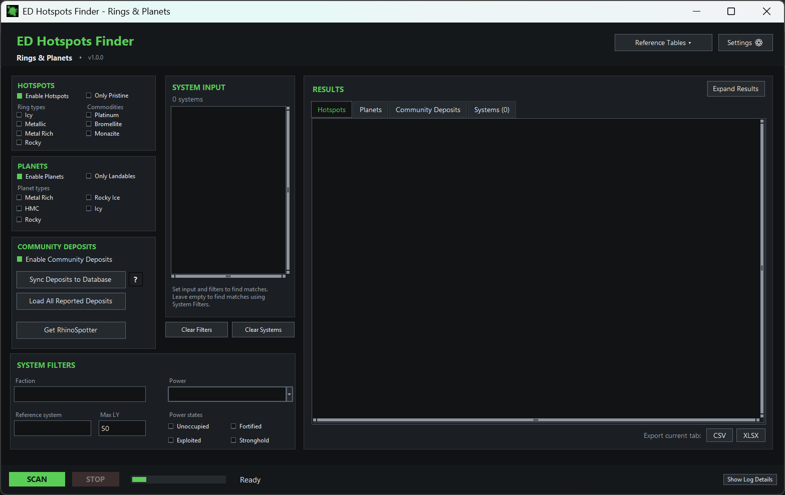
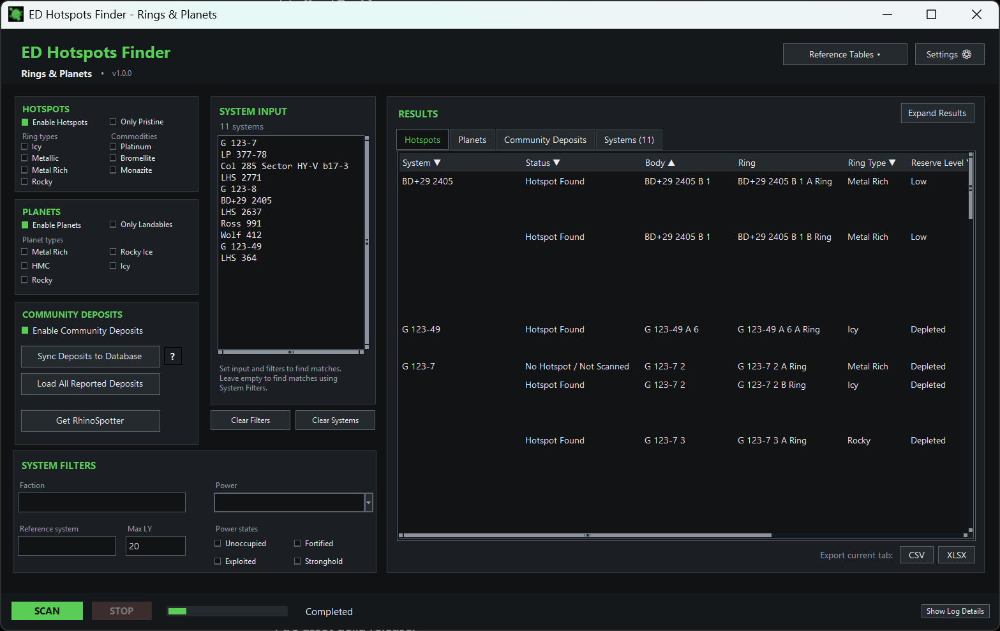
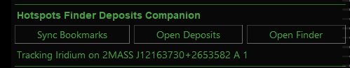
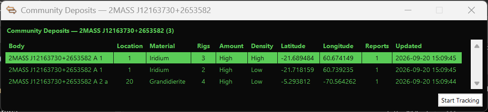
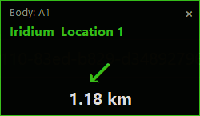

<p align="center">
  
</p>

<h1 align="center">ED Hotspots Finder - Rings & Planets + EDMC plugin </h1>


<p align="center">
  <a href="https://github.com/LittleJacket99/ED-Hotspots-Finder-Rings-and-Planets-with-EDMC-plugin/releases/latest">Download latest Windows release</a>
  ·
  <a href="RELEASE_NOTES.md">Release notes</a>
</p>

## Finder + EDMC Plugin

This project includes two connected tools for **Elite Dangerous**:

- **[ED Hotspots Finder - Rings & Planets](#finder)** — the desktop application for multi-system search, filtering and analysis across rings, hotspots, planets and Community Deposits.
- **[Hotspots Finder EDMC Plugin](#edmc-plugin)** — the lightweight in-game companion for synchronizing RhinoSpotter bookmarks, checking Community Deposits in the current system and tracking selected surface deposits.

Both tools use the same **Community Deposits** service: the Finder is the main search and analysis client, while the EDMC Plugin provides quick access to the same shared data during gameplay.

<a id="finder"></a>

## ED Hotspots Finder - Rings & Planets

**ED Hotspots Finder - Rings & Planets** is a Windows companion for **Elite Dangerous** designed to search and analyze multiple star systems at once.

Its main goal is to help commanders identify systems that satisfy specific requirements, with a particular focus on **Powerplay-oriented system research**.

You can provide a list of systems manually or discover systems through filters such as **Power**, **Power State**, **Faction**, **Reference System** and **Distance**. The selected systems can then be searched for the characteristics you actually need: specific **ring types**, **mining hotspots**, **pristine reserves**, **planet types**, **landable bodies**, **volcanism** and other planetary information.

Instead of checking systems one by one across different tools, ED Hotspots Finder is designed to reduce a large candidate area to the systems that actually match the requirements of a Powerplay task or other targeted search.

<p align="center">
  
</p>

## Main features

- Search many systems in a single operation.
- Manual **System Input** with automatic Spansh name normalization.
- System discovery through **Faction**, **Power**, **Power State**, **Reference System** and distance filters.
- Search for specific ring types and mining hotspots.
- Filter hotspots by commodity and pristine reserve status.
- Search planets by body type, landability and volcanism.
- View arrival-distance and other body information where available.
- Search the shared **Community Deposits** database.
- Synchronize compatible RhinoSpotter discoveries with the community database.
- Sort and filter result tables directly inside the application.
- Export results to **CSV** and **XLSX**.
- Expand or restore the results area and open the detailed activity log.
- Choose between **Deep Black** and **Green Warm** themes.
- UI scaling options: 100%, 110%, 115% and 125%.

Spansh and Community Deposits are community-data sources. Missing or outdated data can affect results; no match is not proof that a system or body contains no relevant feature.

## Powerplay-oriented system research

The application is particularly useful when a Powerplay task requires searching a large set of systems for specific physical characteristics.

A commander can first define the strategic search area through Powerplay, faction and distance filters, then search the resulting systems for the required hotspot, ring or planetary conditions.

This combines **where to search** with **what the system must contain** in a single workflow.

<p align="center">
  
</p>

<p align="center"><em>Example search results after applying system and body filters.</em></p>

<a id="edmc-plugin"></a>

## Hotspots Finder EDMC Plugin

The **Hotspots Finder EDMC Plugin**, displayed inside EDMC as **Hotspots Finder Deposits Companion**, is the in-game Community Deposits companion to the desktop Finder.

It is designed for the actions that are most useful while Elite Dangerous is running:

- **Sync Bookmarks** upload your bookmarks through RhinoSpotter 5.1+ `rs_api.py`;
- **Scan System** for Community Deposits in the current EDMC system;
- reopen cached results with **Open Deposits** without unnecessary repeat requests;
- use **Refresh Deposits** when relevant synchronized data changed;
- view **Body, Location, Material, Rigs, Amount, Density, Latitude, Longitude, Reports and Updated**;
- select a deposit and use **Start Tracking** to open the compact navigation HUD;
- see the target body, material, RhinoSpotter **Location**, relative direction and altitude-aware distance while approaching the deposit;
- launch the desktop Finder directly with **Open Finder**.

The plugin uses the same Community Deposits backend as the desktop application and does not maintain a separate deposit database.

<p align="center">
  
</p>

<p align="center"><em>Compact controls inside EDMarketConnector.</em></p>

<p align="center">
  
</p>

<p align="center"><em>Community Deposits results for the current system, including RhinoSpotter Location.</em></p>

<p align="center">
  
</p>

<p align="center"><em>Always-on-top navigation HUD for a selected surface deposit.</em></p>

Documentation: **[Hotspots Finder EDMC Plugin](docs/EDMC_COMPANION.md)** · **[Plugin release notes](docs/COMPANION_RELEASE_NOTES.md)**

## Community Deposits

ED Hotspots Finder also includes a community project whose goal is to build a **shared database of planetary surface deposits discovered by Elite Dangerous players**.

A deposit found by one commander can become useful information for other commanders searching the same region or looking for specific planetary resources.

The idea is simple:

**Discover → Bookmark → Synchronize → Share → Search**

Players can record planetary deposits while playing, contribute compatible discoveries to the shared database, and make them available through ED Hotspots Finder's multi-system searches.

### Help build the database

The usefulness of Community Deposits grows with every contribution.

If you explore planetary surfaces or participate in surface mining, you can help by recording the deposits you encounter and synchronizing compatible records with the shared database.

ED Hotspots Finder can both search deposits already reported by other commanders and contribute compatible locally recorded deposits to the shared dataset.

Read more: **[Community Deposits documentation](docs/COMMUNITY_DEPOSITS.md)**

## RhinoSpotter integration

Community deposit collection is integrated with **[RhinoSpotter](https://github.com/Fumlop/EDRhinoSpotter)**, an independent EDMC plugin developed by **Fumlop** for Elite Dangerous surface mining.

RhinoSpotter can record planetary mining locations and related information while a commander is exploring the surface. ED Hotspots Finder can use compatible locally recorded discoveries as a contribution source for the Community Deposits database.

This creates a complementary workflow:

**RhinoSpotter records discoveries in-game → ED Hotspots Finder synchronizes them → Community Deposits makes them searchable across systems.**

RhinoSpotter is a separate project and is not bundled with ED Hotspots Finder.

Read more: **[RhinoSpotter integration](docs/RHINOSPOTTER.md)**

## Quick start

1. Download the versioned Windows executable from **Releases**.
2. Run the downloaded versioned executable, for example **ED-Hotspots-Finder-Rings-and-Planets-v1.0.2.exe**.
3. Enter one or more systems in **System Input**, or leave it empty and configure **System Filters**.
4. Enable **Hotspots**, **Planets** and/or **Community Deposits** as needed.
5. Set the relevant filters.
6. Click **SCAN**.
7. Review the result tabs, use column filters if needed, and export the current tab to CSV or XLSX.

Python is not required for the public Windows build.

## System Input and normalization

Enter one system per line. Before the scan starts, each manual system name is resolved against Spansh and converted to its canonical capitalization.

For example:

```text
mehit   -> Mehit
wuRANgo -> Wurango
SEEDI   -> Seedi
```

Duplicate systems are removed after normalization. If a name cannot be resolved, the scan reports the error instead of silently querying an invalid system.

## System Filters

When **System Input** is empty, the app can resolve systems from filters instead.

Available controls include:

- **Faction**
- **Power**
- **Power States**
- **Reference System**
- **Distance**

The Reference System is normalized through the same Spansh system-name lookup used for manual input.

## Hotspots

Hotspot searches can be filtered by ring type and mineral/material. **Only Pristine** limits results to pristine systems where the available source data supports that classification.

## Planets

Planet searches support body-type filters and **Only Landables**. Returned data can include landability, volcanism and arrival distance where supplied by Spansh.

## Export

The current result tab can be exported to:

- **CSV** — UTF-8 with BOM and semicolon delimiters for convenient opening in European Excel installations.
- **XLSX** — generated locally by the application, with a frozen header row and autofilter.

## Settings

Application settings are stored locally in:

```text
%APPDATA%\HotspotsFinder\config.json
```

Current settings include startup filter defaults, RhinoSpotter options, theme and UI scale.

## Troubleshooting

| Problem | What to check |
| --- | --- |
| A system name is rejected | Check the spelling and whether Spansh can resolve the system. |
| A scan returns unexpected or incomplete data | Open **Log Details**, verify the active filters and retry with a small system list. |
| Community Deposits cannot be loaded | Check the Internet connection and retry later; the community API may be temporarily unavailable. |
| RhinoSpotter sync finds no bookmarks | Open Settings and verify that the RhinoSpotter source is detected. RhinoSpotter 5.1+ is read through its documented `%LOCALAPPDATA%\\EDMarketConnector\\plugins\\RhinoSpotter\\rs_api.py`; direct SQLite and legacy JSON access are compatibility fallbacks for older installations only. |
| The interface is too large or too small | Open **Settings**, change UI Scale, save and restart the app. |
| Windows SmartScreen appears | The executable is currently unsigned. Confirm that it was downloaded from this repository's Releases page. |

## Build from source

These steps are for developers and release maintainers.

1. Install Python on Windows.
2. Clone or download this repository.
3. Install runtime requirements:

```powershell
python -m pip install -r requirements.txt
```

4. Install PyInstaller:

```powershell
python -m pip install pyinstaller
```

5. Run:

```text
build_windows_v8.bat
```

The current internal build files still use **v8** in their filenames because that was the final development iteration before the first public release. Public versioning started at **v1.0.0**; the current release line is **v1.0.2**.

The build uses `HotspotsFinder-v8.spec`, bundles `app.ico` and `ED_Hotspots_Finder.png`, and uses `hotspots_finder_gui_v8_final.py` as the entry point. The GitHub Release publishes the standalone executable with the public version in its filename.

A successful release build creates:

```text
release\v1.0.2\ED-Hotspots-Finder-Rings-and-Planets-v1.0.2.exe
release\v1.0.2\Hotspots-Finder-EDMC-Plugin-v1.0.2.zip
release\v1.0.2\SHA256.txt
```

`build-v8` and `dist-v8` remain internal intermediate build directories and are not release artifacts.

## Project structure

| Component | Role |
| --- | --- |
| `hotspots_finder_gui_v8_final.py` | Final desktop entry point and application-level behaviour |
| `hotspots_finder_gui_v8_*.py` | Modular GUI layers used by the final interface |
| `finder_engine.py` | Shared scan/filter helpers |
| `local_scan.py` | Local scan orchestration |
| `system_filter_search.py` | Faction/Power/Reference System resolution and system-name canonicalization |
| `community_deposits.py` | Community Deposits API client |
| `rhinospotter_sync.py` | RhinoSpotter record normalization and upload logic |
| `rhinospotter_sync_service.py` | GUI-friendly RhinoSpotter sync wrapper |
| `results_export.py` | CSV/XLSX export helpers |
| `app_settings.py` | Persistent local settings |
| `startup_splash.py` | Startup splash and first-window reveal handling |
| `HotspotsFinder-v8.spec` | PyInstaller configuration used by the current Windows build |

## Privacy and network access

The application may make network requests to:

- **Spansh** for Elite Dangerous system/body data and system-name resolution.
- **ED Alliance Community Deposits** for community deposit retrieval and RhinoSpotter report synchronization.

Application settings remain local in `%APPDATA%\HotspotsFinder\config.json`.

## Related projects and data sources

- **[RhinoSpotter](https://github.com/Fumlop/EDRhinoSpotter)** by Fumlop — EDMC surface-mining plugin used as an optional source for Community Deposits contributions.
- **Spansh** — system and body data, system-name resolution and search support.
- **ED Alliance Community Deposits** — shared community database used to store and retrieve player-reported planetary deposits.

## License

ED Hotspots Finder - Rings & Planets is released under the **GNU General Public License v3.0 (GPL-3.0)**.

See [LICENSE](LICENSE) for the full license text.
